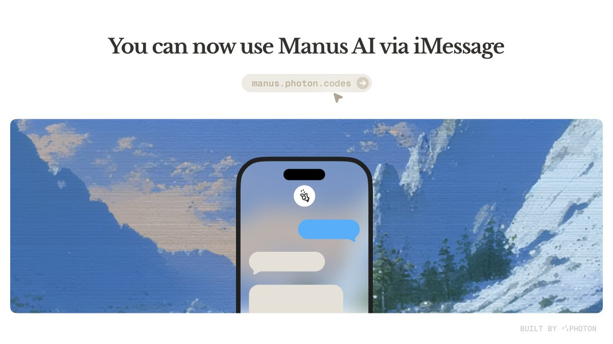

# Manus on iMessage



Bring Manus AI to iMessage. Built by [Photon](https://photon.codes).

## Overview

TypeScript monorepo that bridges iMessage and [Manus AI](https://manus.im). Users text a phone number, Manus handles their request, and the response comes back as an iMessage.

**How it works:**
1. User texts the Photon number via iMessage
2. Message is queued, debounced, and classified (new task vs follow-up)
3. Manus AI processes the task
4. Results are delivered back via iMessage

## Services

| Service | Description |
|---------|-------------|
| **Backend** | API server — connection flow, webhooks, iMessage event handling |
| **Worker** | Message processor — debouncing, classification, Manus API integration |
| **SLM Classifier** | Intent router — classifies messages for agentic routing |

**Shared packages:**
- `packages/shared` — Types, schemas, utilities
- `packages/database` — Database ORM and migrations

## Quick Start

**Prerequisites:** Node.js 20+, pnpm 8+, Docker

```bash
cp .env.example .env    # Edit with your credentials
pnpm install
make dev                # Starts postgres, redis, runs migrations, starts all services
```

Or manually:

```bash
docker compose up -d postgres redis
pnpm db:generate && pnpm db:migrate
pnpm dev
```

## Production Deployment

```bash
docker compose -f docker-compose.prod.yml up -d
```

All services run in Docker. The backend entrypoint handles migrations automatically on startup.

## Configuration

Copy `.env.example` and fill in the required values. See the file for the full list of options.

## Architecture

```
User ──iMessage──► Backend ──► Queue ──► Worker ──► Manus AI
                       ◄─── Webhooks ◄──────────────────┘
```

**Key features:**
- Intent classification (new task vs follow-up)
- Typing indicators
- Free tier with optional API key upgrade
- File attachment support
- Tapback reactions for status feedback

## Project Structure

```
manus/
├── packages/
│   ├── shared/              # Types, schemas, utilities
│   └── database/            # Database ORM, migrations
├── services/
│   ├── backend/             # API server + event handling
│   ├── worker/              # Message processing
│   └── slm-classifier/      # Intent classification
├── docker-compose.yml       # Dev environment
├── docker-compose.prod.yml  # Production environment
├── Makefile                 # Common commands
└── .env.example             # Environment template
```

## Development

```bash
make dev          # Start everything
make reset-db     # Reset database (deletes all data)
make db-studio    # Open Prisma Studio
make logs         # Tail all Docker logs

# Individual services
pnpm --filter @imessage-mcp/backend dev
pnpm --filter @imessage-mcp/worker dev

# Database
pnpm db:generate  # Regenerate Prisma client
pnpm db:migrate   # Run migrations

# Health check
curl http://localhost:3000/health
```

## Troubleshooting

**Messages not processing:** Check worker logs. Verify `IMESSAGE_SERVER_URL` and `IMESSAGE_API_KEY` are correct.

**Follow-ups creating new tasks:** Check classifier logs. Ensure `DETECTION_MODE=slm` and `OPENROUTER_API_KEY` is set.

**Webhooks not received:** Verify `PUBLIC_URL` is accessible from the internet.

**Reset everything:**
```bash
docker compose down -v && docker compose up -d
```

---

Built by [Photon](https://photon.codes)
